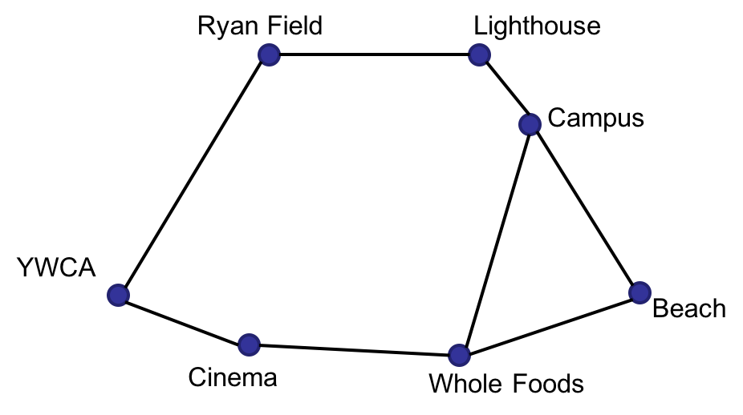

# Search alogrithm - BFS, DFS, Astar

## Back Story

There is a food delivery startup called BigByte. 
BigByte's target client restaurants and ordering customers are all based in Evanston, which has a handful of landmarks and a heavily fluctuating traffic pattern. To ensure that your delivery fleet works efficiently, I came up with a route planning system. 

Note, All major map services are expensive but fortunately, restaurants and Heavanston residents' homes are close to landmarks, and we only need to tell delivery drivers how best to reach one landmark from another.A printed map of all Evanston roads and data from a traffic survey maintained by University Archive.
I implementated the follwing search algorithm to find the best way to travel between any pair of landmarks in town
**Breadth-first Search (BFS)**,
**Depth-first Search (DFS)**, 
**A\* algorithm** 

## Task Parameters

A diagram explaining the relative position of major landmarks of Heavanston is shown below. 



The goal is to create algorithms that will  calculate fastest (thinking shortest in time) route between any pairs of the landmarks.

## A\* function layout 

The A\* function will be given two routing maps as inputs. 
The first map specifies the straight-line distance between two landmarks and we will refer to this as the **distance map**. The second map is based on the data from the Archive traffic survey. It specifies the expected time it takes a driver to go from one landmark to a neigbhoring landmark; we will refer to this as the **time map**. 


For all three implementations (BFS, DFS, and A\*), I used the time differences between places as the main metric, not distance. 

### heuristic
A star is an informed search algorithm, as it uses information about path cost and also uses heuristics to find the solution.In this casee,the distance from the start to your current location will be time-based, but the distance from your current location to the destination will be distance-based.The heurstic will be the sum of both distances
The following is an example time map.

```python
Time_map = {
'Campus':
	{'Campus':None,'Whole_Food':4,'Beach':3,'Cinema':None,'Lighthouse':1,'Ryan Field':None,'YWCA':None},
'Whole_Food':
	{'Campus':4,'Whole_Food':None,'Beach':4,'Cinema':3,'Lighthouse':None,'Ryan Field':None,'YWCA':None},
'Beach':
	{'Campus':4,'Whole_Food':4,'Beach':None,'Cinema':None,'Lighthouse':None,'Ryan Field':None,'YWCA':None},
'Cinema':
	{'Campus':None,'Whole_Food':4,'Beach':None,'Cinema':None,'Lighthouse':None,'Ryan Field':None,'YWCA':2},
'Lighthouse':
	{'Campus':1,'Whole_Food':None,'Beach':None,'Cinema':None,'Lighthouse':None,'Ryan Field':1,'YWCA':None},
'Ryan Field':
	{'Campus':None,'Whole_Food':None,'Beach':None,'Cinema':None,'Lighthouse':2,'Ryan Field':None,'YWCA':5},
'YWCA':
	{'Campus':None,'Whole_Food':None,'Beach':None,'Cinema':3,'Lighthouse':None,'Ryan Field':5,'YWCA':None}}
```

In this example, the traffic time between Campus and Beach is `3`. `None` indicates that there is no road which directly connects the two landmarks. Off-road driving is prohibited by local law, so drivers must only take the roads marked on the diagram above. Combining this legal requirement and with the volatile traffic pattern of Evanston, it is certain that the distance map can only be used as a heuristic for the A\* algorithm. It is also noteworthy that the time it takes traveling on the two sides of the same road is most likely different. 


`a_star_gradingtest.py` includes all the test for DFS, BFS, A star